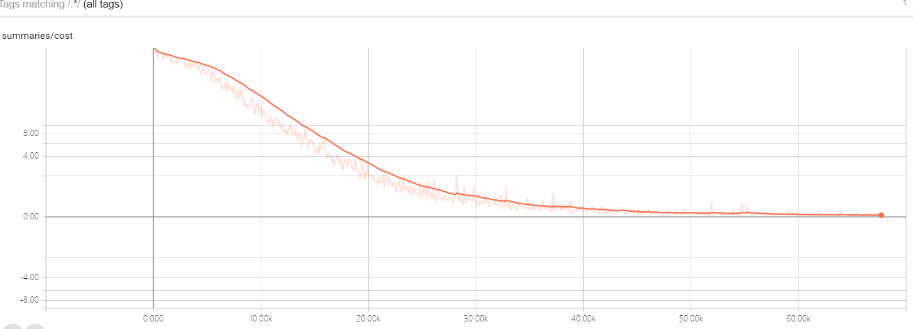
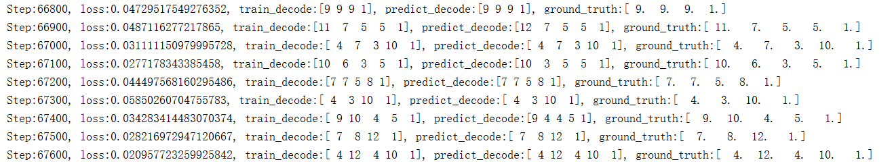

## Attention-ocr-toy-example

The goal of this project is to bring me to try and experiment with the seq2seq neural network architecture with attention mechanism and latest dynamic decode API of tensorflow.  This is done by solving a toy example about optical character recognition. For simplicity purposes, vocabulary only include digits. But you can hack more bigger vocabulary by modify the code with little effort.

### Tools

[tensorflow 1.4](https://github.com/tensorflow/tensorflow)

opencv

python3.6

## Training processing

## Future work

[Spatial Transformer Networks](https://arxiv.org/pdf/1506.02025.pdf)

[Joint CTC Attention](https://arxiv.org/pdf/1609.06773v1.pdf)

### Reference

[Attention-OCR](https://github.com/da03/Attention-OCR)

[tf_examples](https://github.com/ilblackdragon/tf_examples)

